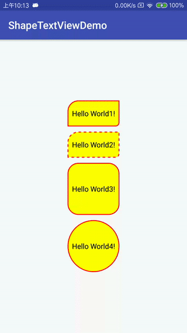

## Android 带形状的TextView（通过属性控制背景及边框选择器）
可配置属性：

    app:solidColor="#ff0"//填充颜色
    app:solidTouchColor="#0f0"//按下填充颜色
    app:strokeColor="#f00"//边框颜色
    app:strokeTouchColor="#00f"//按下边框颜色
    app:strokeWith="5px"//边框宽度
    app:textTouchColor="#fff"//按下字体颜色
        
    app:dashGap="5dp"//虚线间隔距离
    app:dashWidth="5dp"//虚线宽度
        
    app:radius="20dp"//圆角度数（会覆盖以下四个度数）
    app:topLeftRadius="20dp"//左上角圆角度数
    app:topRightRadius="0dp"//右上角圆角度数
    app:bottomLeftRadius="0dp"//左下角圆角度数
    app:bottomRightRadius="20px"//右下角圆角度数
        
    app:shapeType="oval"//形状（rectangle oval line ring）
   
## Demo 图片
